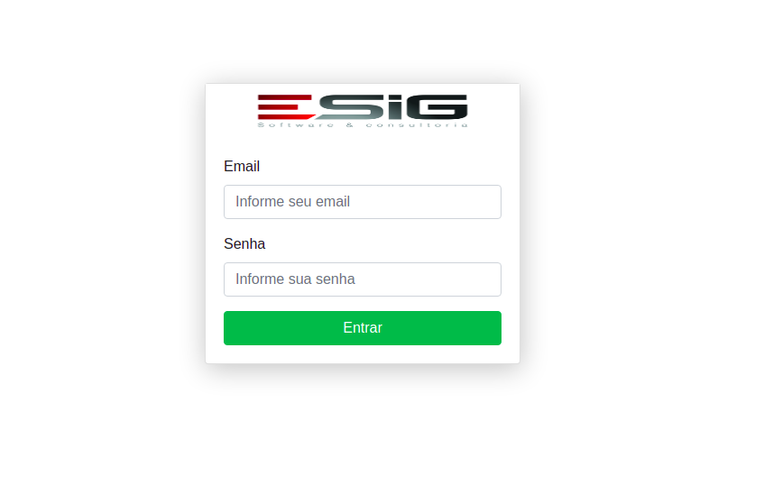
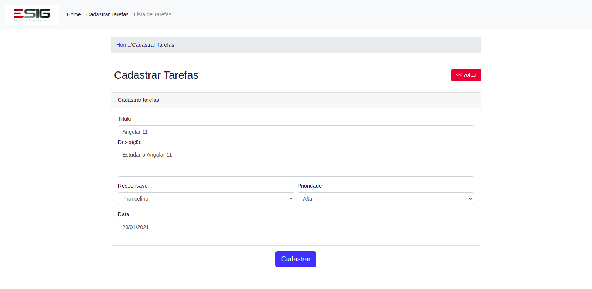
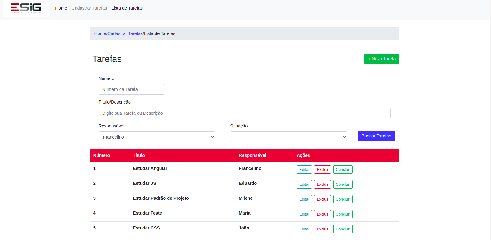
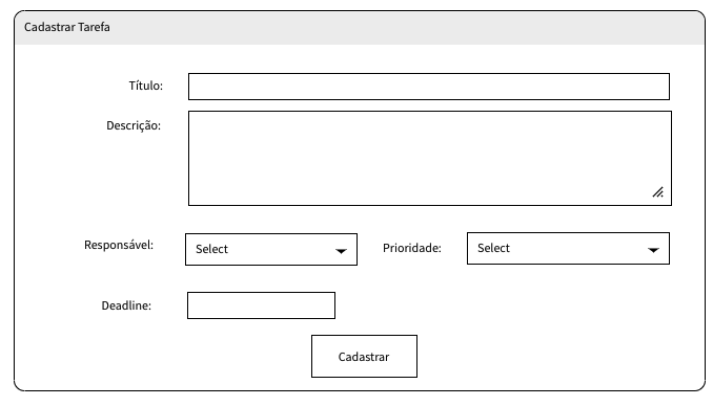
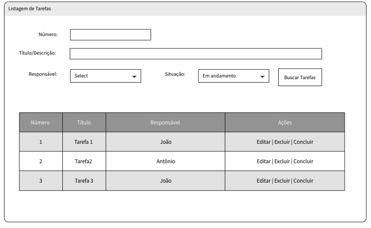

<h1 aling="center">
  Projeto Sistema de Gestão de Tarefas
</h1>

<h1>
  
  
  
</h1>

<h3 align="center">
  <a href="">Acessar a demostração</a>
</h3>

---

## Indice

- [Indice](#indice)
- [Sobre](#sobre)
- [Aplicação exemplo](#aplicação-exemplo)
- [Tecnologias utilizadas](#tecnologias-utilizadas)
- [Como baixar o projeto](#como-baixar-o-projeto)
- [Autor](#autor)
  
---

## Sobre 

O Projeto **Sistema de Gestão de Tarefas** foi desenvolvido como parte do processo seletivo do Grupo Esig. Assim é possivel colocar em prática o conhecimento adquirido na Universidade. O Sistema permite realizar o CRUD (Cadastrar, Listar, Atualizar e excluir) tarefas. O login e senha são criados de forma fixa e uma vez logado no sistema pode navegar em todas as opções do sistema. Se o usuário estiver deslogado, então não pode acessar as rotas do sistema, na tentativa de acessar as rotas sem está logado o sistema vai direcionar sempre para a tela de login, é possivel realizar busca de tarefa por nome da tarefa que esta na lista. Para Mokar os dados da aplicação foi utilizado o [In Memory DB](https://github.com/angular/in-memory-web-api), assim podendo realizar todas as operações do CRUD.

---

## Aplicação exemplo

A aplicação exemplo consiste em criar um simples gerenciador de tarefas
com as seguintes funcionalidades:
- Criar uma tarefa
- Atualizar a tarefa
- Remover a tarefa
- Listar tarefas 

A tarefa deve ter os seguintes dados: Título, Descrição, Responsável, Prioridade(Alta, Méia, Baixa)

Tela Exempo:

<h1>
  
</h1>
<h1>
  
</h1>

O concluir tarefa deverá marcar a tarefa como concluída, assim ela não
deverá mais constar na lista de andamento. A situação da tarefa pode ser Em
andamento ou Concluída

---

## Tecnologias utilizadas 

O projeto foi desenvolvido utilizando as seguintes tecnologias
- [Angular 11](https://angular.io/)
- [Bootstrap 4](https://ng-bootstrap.github.io/#/home)
- JavaScript
- HTML
- CSS

---

## Como baixar o projeto

```bash
# Clonar o repositório em sua máquina 
$ git clone https://github.com/francelinom/taskEsig

# Entrar na pasta do projeto 
$ cd taskEsig

# Instalar todas as dependências 
$ npm i

# Iniciar o projeto 
$ ng serve
```
---
## Autor

Desenvolvido por **Francelino Marcílio da Silva** 
<h1>
  
</h1>
